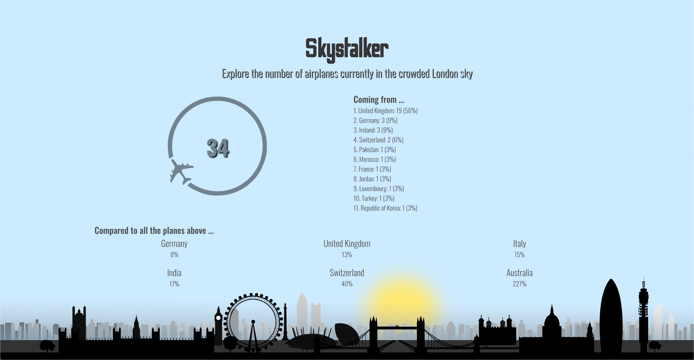

###  General Assembly, Software Engineering Immersive
# Project #X: Skystalker
 

## Overview

This is an extra-curricular project of the software engineering immersive course at GA London. The assignment was to create a **react app** using data from any API of our choice. The assignment was to be completed **individually** over **one weekend**. 

Using live air traffic data from the OpenSky API, my app displays the current number of airplanes above London, putting this into perspective by comparing it to the total number of planes in the sky above entire countries.

You can launch the game on GitHub pages [here](https://katheich.github.io/project-x/), or find the GitHub repo [here](https://github.com/katheich/project-x).

## Brief

- Create a react app that talks to an API and displays some data
- Use any API you like
- Use some new libraries in your creation
- Host it on Github pages

## Technologies used

- HTML
- CSS
- JavaScript (ES6)
- React.js
- Anime.js
- OpenSky API
- Git and GitHub
- BoundingBox
- Bulma
- Google Fonts

## Approach

- Found bounding boxes using BoundingBox and stored them in an array that the code loops through, can be expanded easily
  ```js
  const boundingBoxes = {
    'United Kingdom': [-14.02,49.67,2.09,61.06],
    'Switzerland': [5.9559,45.818,10.4923,47.8085],
    'Germany': [5.87,47.27,15.04,55.1],
    'Italy': [6.63,35.29,18.78,47.09],
    'India': [68.11,6.55,97.4,35.67],
    'Australia': [112.63,-43.65,153.75,-10.55]
  }
  ```
- Fetching data from the API at the very start and handing it down to components which do different things with it
- One fetch request for London (storing all data) and each country (storing only number of planes, i.e. length of array)
  - already sorts the countries in order of number of planes when saving them in state
  ```js
        .then(resp => {
        let countries = [...this.state.countries]
        countries
          .push({
            name: country,
            count: resp.states.length
          })

        countries = countries.sort(function(a, b) { return b.count - a.count } )
        this.setState({ countries }, () => console.log(this.state))
      })
  ```
- API is not always the fastet, and since not possible to calculate fractions, the components are not mounted until the data from London and at least one country has been returned (until then show a loading screen)

### London section
  - takes detailed data from London
  - plane count is enclosed by rotating circle using anime.js
  - puts origins in an array of objects and sorts it according to number of planes

    ```js
      getOrigins(dataLondon) {
      const dataArray = Array.from(dataLondon)
      
      return dataArray
        .reduce((sum, elem) => {
          const origin = elem[2].toString()
          const index = sum.map(e => e.country).indexOf(origin)
          if ( index > -1) {
            sum[index].count += 1
            return sum
          } else {
            sum.push({
              country: origin,
              count: 1
            })
            return sum
          }
        }, [])
        .map((country) => {
          const newCountry = country
          newCountry.perc = Math.round((country.count) / dataArray.length * 100)
          return newCountry
        })
        .sort(function(a, b) { return b.count - a.count } )
    }
    ```

###  Country data
  - takes number of planes above London and each country and divides to get percentage

## Screenshots





## Future features

- Could extend this to more cities
- Could display a map of London showing the location of planes in real time

## Bugs / lessons learned

- Since rotation animation requires adjusting the transform CSS property, and having the number and the circle on top of each to be in the same position, had to wrap the rotating image into an empty wrapper that was fixed in place causing some layout issues with flexbox, maybe there would be more flexible solutions


## Artwork and credit

[OpenSky](https://opensky-network.org/apidoc/) by The OpenSky Network

[BoundingBox](https://boundingbox.klokantech.com/) by Klokan Technologies

[London skyline](https://pixabay.com/vectors/london-skyline-silhouette-city-155996/) from OpenClipart-Vectors via pixabay

... and name provided by Luca Grezio